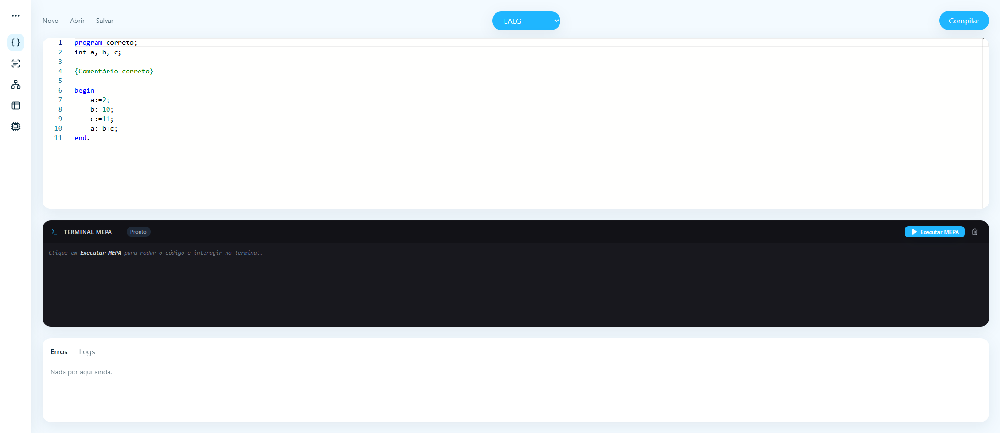
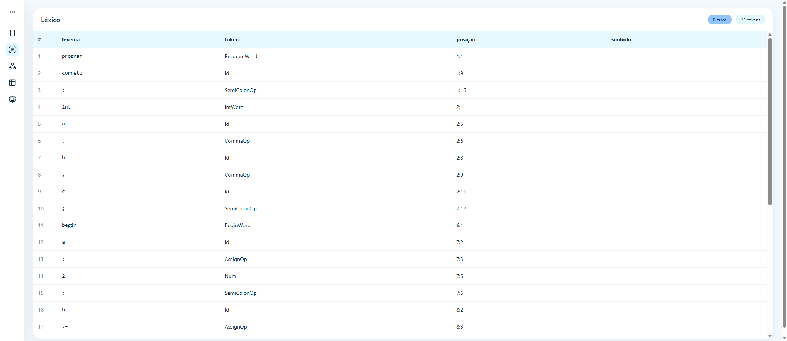
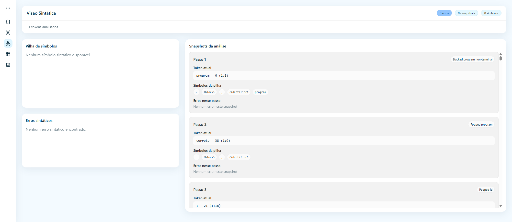
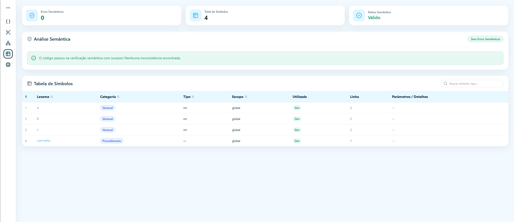
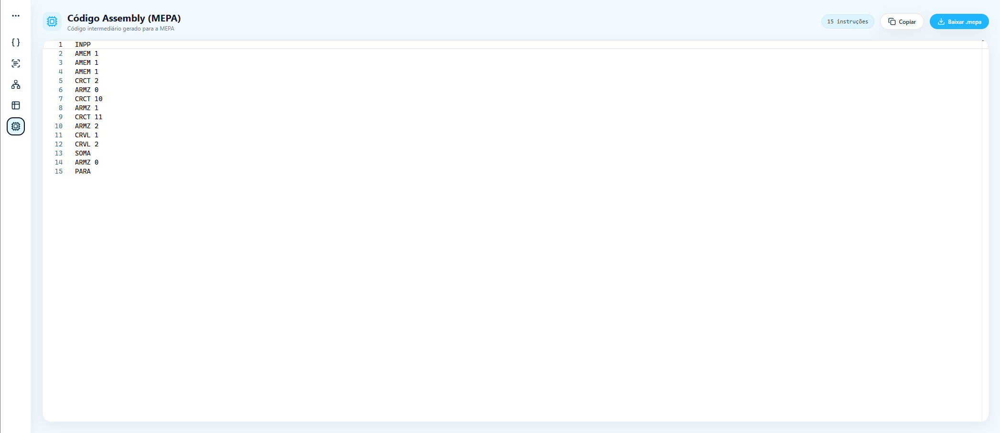
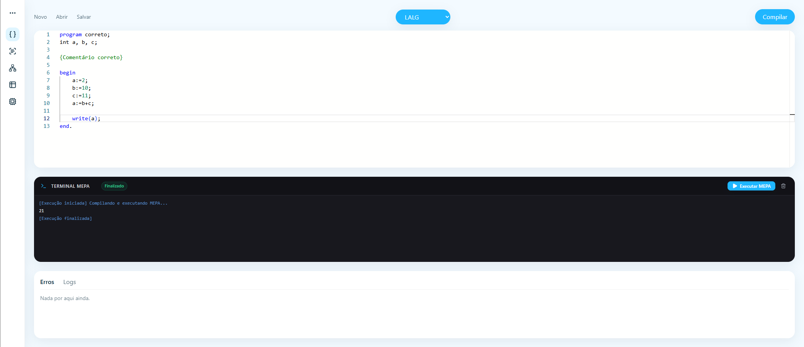

# Trabalho compiladores
Este trabalho consiste no desenvolvimento de uma aplicação capaz de analisar e compilar programas escritos na linguagem LALG, apresentando de forma visual as principais etapas do processo de compilação.

A aplicação recebe um programa-fonte escrito em LALG e permite acompanhar seu processamento passo a passo, desde a análise do código até a geração do programa resultante. O objetivo é facilitar a compreensão do funcionamento de um compilador, tornando visíveis as transformações realizadas sobre o código durante cada etapa.

---

## Gramática LALG

A gramática abaixo descreve a sintaxe da linguagem **LALG** utilizando EBNF.

> **Notação EBNF**
>
> * `[α]` — elemento opcional
> * `{α}` — zero ou mais repetições
> * `α | β` — alternativa entre `α` e `β`
> * `<não-terminal>` — símbolo não-terminal
> * **terminal** — símbolo terminal

### 1. Programa e bloco

```ebnf
<programa> ::= program <identificador> ; <bloco>.

<bloco> ::= [<declaracao de variaveis>]
            [<declaracao de subrotinas>]
            <comando composto>
```

### 2. Declarações

```ebnf
<declaração de variaveis> ::= <tipo> <lista de identificadores>
<lista de identificadores> ::= <identificador> {, <identificador>}

<declaraçao de subrotinas> ::= {<declaracao de procedimento> ;}

<declaraçao de procedimento> ::=
    procedure <identificador> [<parametros formais>] ; <bloco>

<parametros formais> ::=
    ( <secao de parametros formais> { ; <secao de parametros formais>} )

<seçao de parametros formais> ::=
    [var] <lista de identificadores> : <identificador>
```

Todos os identificadores devem ser declarados antes de serem utilizados.

#### Identificadores pré-declarados

* Tipos: `int`, `boolean`
* Procedimentos: `read`, `write`
* Constantes: `true`, `false`

### 3. Comandos

```ebnf
<comando composto> ::= begin <comando> { ; <comando> } end

<comando> ::=
    <atribuicao>
  | <chamada de procedimento>
  | <comando composto>
  | <comando condicional>
  | <comando repetitivo>

<atribuicao> ::= <variavel> := <expressao>

<chamada de procedimento> ::=
    <identificador> [ ( <lista de expressoes> ) ]

<comando condicional> ::=
    if <expressao> then <comando> [else <comando>]

<comando repetitivo> ::=
    while <expressao> do <comando>
```

`read` e `write` são procedimentos pré-declarados para entrada e saída:

```text
read(v1, v2, ..., vn)
write(e1, e2, ..., en)
```

`read` recebe variáveis inteiras e `write` recebe expressões inteiras.

### 4. Expressões

```ebnf
<expressao> ::= <expressao simples> [<relaçao> <expressao simples>]

<relacao> ::= = | <> | < | <= | >= | >

<expressao simples> ::=
    [+ | -] <termo> {(+ | - | or) <termo>}

<termo> ::= <fator> {(* | div | and) <fator>}

<fator> ::=
    <variavel>
  | <número>
  | ( <expressao> )
  | not <fator>

<variavel> ::= <identificador> | <identificador> [ <expressao> ]

<lista de expressoes> ::= <expressao> {, <expressao>}
```

As expressões podem ser **inteiras ou booleanas**, e o compilador deve verificar seus tipos.

### 5. Números e identificadores

```ebnf
<numero> ::= <digito> {<digito>}

<digito> ::= 0 | 1 | 2 | 3 | 4 | 5 | 6 | 7 | 8 | 9

<identificador> ::= <letra> {<letra> | <digito>}

<letra> ::= _ | a-z | A-Z
```

Na implementação, números e identificadores podem ser tratados diretamente como **tokens**, com limite de tamanho definido pelo compilador.

### 6. Comentários

A linguagem LALG possui dois formatos de comentário:

```text
{ comentário de múltiplas linhas }

// comentário de uma linha
```

---

## Instruções da Máquina Virtual

A máquina virtual utiliza uma arquitetura baseada em **pilha**, na qual as instruções manipulam valores armazenados na área de dados.

### Constantes e variáveis

| Instrução | Descrição                                              |
| --------- | ------------------------------------------------------ |
| `CRCT n`  | Empilha a constante `n` na pilha.                      |
| `CRVL n`  | Carrega o valor armazenado na posição `n` e o empilha. |
| `ARMZ n`  | Retira um valor da pilha e armazena na posição `n`.    |

### Operações aritméticas

| Instrução | Descrição                                         |
| --------- | ------------------------------------------------- |
| `SOMA`    | Soma os dois valores no topo da pilha.            |
| `SUBT`    | Subtrai o segundo valor do topo pelo primeiro.    |
| `MULT`    | Multiplica os dois valores no topo da pilha.      |
| `DIVI`    | Divide o segundo valor do topo pelo primeiro.     |
| `MODI`    | Calcula o resto da divisão entre os dois valores. |
| `INVR`    | Inverte o sinal do valor no topo da pilha.        |

### Operações lógicas

| Instrução | Descrição                                                          |
| --------- | ------------------------------------------------------------------ |
| `CONJ`    | Realiza uma operação lógica **AND** entre os dois valores do topo. |
| `DISJ`    | Realiza uma operação lógica **OR** entre os dois valores do topo.  |
| `NEGA`    | Nega logicamente o valor no topo da pilha (**NOT**).               |

### Operações relacionais

As operações relacionais retiram dois valores da pilha e empilham `1` quando a relação é verdadeira ou `0` caso contrário.

| Instrução | Descrição                                                        |
| --------- | ---------------------------------------------------------------- |
| `CMME`    | Verifica se o segundo valor é menor que o primeiro (`<`).        |
| `CMMA`    | Verifica se o segundo valor é maior que o primeiro (`>`).        |
| `CMIG`    | Verifica se os valores são iguais (`=`).                         |
| `CMDG`    | Verifica se os valores são diferentes (`<>`).                    |
| `CMAG`    | Verifica se o segundo valor é maior ou igual ao primeiro (`>=`). |
| `CMEG`    | Verifica se o segundo valor é menor ou igual ao primeiro (`<=`). |

### Desvios

| Instrução | Descrição                                                             |
| --------- | --------------------------------------------------------------------- |
| `DSVS n`  | Realiza um desvio incondicional para a instrução `n`.                 |
| `DSVF n`  | Retira um valor da pilha e desvia para `n` caso ele seja falso (`0`). |

### Entrada e saída

| Instrução | Descrição                                                |
| --------- | -------------------------------------------------------- |
| `LEIT`    | Lê um valor inteiro da entrada e o empilha.              |
| `LECH`    | Lê um caractere da entrada e o empilha.                  |
| `IMPR`    | Imprime o valor inteiro no topo da pilha.                |
| `IMPC`    | Imprime o caractere no topo da pilha.                    |
| `IMPE`    | Imprime um valor inteiro seguido de uma quebra de linha. |

### Gerenciamento de memória

| Instrução | Descrição                                   |
| --------- | ------------------------------------------- |
| `INPP`    | Inicializa ou reinicializa a área de dados. |
| `AMEM n`  | Aloca `n` posições na área de dados.        |
| `DMEM n`  | Libera `n` posições da área de dados.       |

### Controle de execução

| Instrução | Descrição                                                             |
| --------- | --------------------------------------------------------------------- |
| `PARA`    | Finaliza a execução do programa.                                      |
| `NADA`    | Não realiza nenhuma operação; apenas avança para a próxima instrução. |

---

### Screenshots










